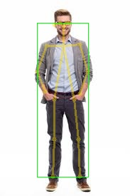
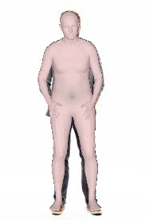
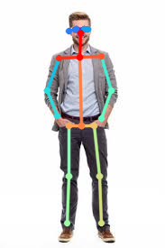

# This repository is a combination of GTRS(3D human mesh recontruction) and lightweight openpose, a 2D pose detection model.

[Here](https://colab.research.google.com/drive/1jt-6hhNHWyy1oR2P6NKA4RDG0NOVNdIl?usp=sharing) is the complete demonstration of inferece of pose detection and mesh reconstruction in google colab
<br></br>
<br></br>

# Real-time 2D Multi-Person Pose Estimation on CPU: Lightweight OpenPose

This repository contains training code for the paper [Real-time 2D Multi-Person Pose Estimation on CPU: Lightweight OpenPose](https://arxiv.org/pdf/1811.12004.pdf). 
It detects a skeleton (which consists of keypoints and connections between them) to identify human poses for every person inside the image. 
The pose may contain up to 18 keypoints: ears, eyes, nose, neck, shoulders, elbows, wrists, hips, knees, and ankles. 


<p align="center">
  
</p>

[Colab Implementation](https://colab.research.google.com/drive/1Yt0_RedU_MwWYRz100lcEnXmdJjfr2U9?usp=sharing)


## Table of Contents

* [Requirements](#requirements)
* [Prerequisites](#prerequisites)
* [Pre-trained model](#pre-trained-model)
* [Conversion to OpenVINO format](#openvino)
* [Local Demo](#local-demo)
* [Python demo](#python-demo)
* [Citation](#citation)


## Requirements

* Ubuntu 16.04
* Python 3.6
* PyTorch 0.4.1 (should also work with 1.0, but not tested)

## Prerequisites
1. Install requirements `pip install -r requirements.txt`

## Pre-trained model <a name="pre-trained-model"/>

The model expects normalized image (mean=[128, 128, 128], scale=[1/256, 1/256, 1/256]) in planar BGR format.
Pre-trained on COCO model is available at: https://download.01.org/opencv/openvino_training_extensions/models/human_pose_estimation/checkpoint_iter_370000.pth.

## Conversion to OpenVINO Formatv <a name= openvino"/>

1. To convert PyTorch model to ONNX format: run script in terminal `python <path_to>scripts/convert_to_onnx.py --checkpoint-path <CHECKPOINT>`.
2. It then produces `human-pose-estimation.onnx`.
3. Download the openvino toolkit from[here](https://software.intel.com/en-us/openvino-toolkit/choose-download)
4. Now, to convert ONNX model to OpenVINO format with Model Optimizer: run `python <path_to>mo.py --input_model human-pose-estimation.onnx --input data --mean_values data[128.0,128.0,128.0] --scale_values data[256] --output stage_1_output_0_pafs,stage_1_output_1_heatmaps`.
5. This then produces model `human-pose-estimation.xml` and weights `human-pose-estimation.bin` in single-precision floating-point format (FP32).
6. To run the cpp demo, donwload the [open_model_zoo](https://github.com/openvinotoolkit/open_model_zoo/tree/master).
7. Then navigate to the directory human_pose_estimation_demo to run the inference on your local.
8. Then run `<path-to>/human_pose_estimation_demo/cpp/<cpp_file> -m <path_to>/human-pose-estimation.xml -i <path_to_video_file>` for the inference on `CPU`.

## Local Demo <a name="local-demo"/>
 
1. To run the openpose demo locally, convert the pytorch model to torch script.
2. you can do this by running `torch.jit.script(model_name)` and save the converted model
3. In the demo.py file load the exported torch script file by `torch.jit.load('Path_to_script.pt')`
4. Then run `python demo.py --checkpoint-path <path_to>/checkpoint_iter_370000.pth --video 0` for the inference on `CPU`.
5. You would see the inference running in real time.

[Here](https://drive.google.com/file/d/1x2-G1FtES330H6Y9A2onz4iodFzI29C_/view?usp=sharing) is a live demo for local inference.

## Python Demo <a name="python-demo"/>

To run the python demo from a webcam:
* `python demo.py --checkpoint-path <path_to>/checkpoint_iter_370000.pth --video 0`
  
<br></br>
<br></br>

# A Lightweight Graph Transformer Network for Human Mesh Reconstruction from 2D Human Pose

The project is an official implementation of The paper [A Lightweight Graph Transformer Network for Human Mesh Reconstruction from 2D Human Pose](https://arxiv.org/pdf/2111.12696).

<p align="center">
  
  
</p>

## Installation

Use [Anaconda](https://www.anaconda.com/) virtual environment and install [PyTorch](https://pytorch.org/) >= 1.2 according to your GPU driver and Python >= 3.7.2

### Setup with Conda

Create a new conda environment and install all the relevant dependencies. 

```bash
# Create a new environment
conda create --name gtrs python=3.8
conda activate gtrs

# Install Pytorch based on your GPU, for example:
conda install pytorch==1.10.0 torchvision==0.11.0 cudatoolkit=11.3 -c pytorch

```

We provide the  `requirements.txt` that lists the packages you need. 

Although after installing you might find that some of the packages wouldn't be installed due to version mismatch and other reasons. Therein, install the reamining packages with the below commands.

```bash
!conda install cctbx202112::brotli

!conda install anaconda::matplotlib-base

!conda install conda-forge::yaml

!conda install conda-forge::xorg-libxdmcp

!conda install cctbx202211::xorg-libxau

!pip install torchaudio

!conda install conda-forge::sip

!pip install --upgrade setuptools

!conda install conda-forge::qt

!conda install pytorch::pytorch-mutex

!conda install conda-forge::python_abi

!pip install PyQt5

!conda install anaconda::mkl_fft

!conda install anaconda::mkl-service

!conda install anaconda::libuv

!conda install cctbx202008::libgfortran-ng

!conda install cctbx202208::lcms2

!conda install cctbx202008::jpeg

!conda install pytorch::ffmpeg

!pip install --upgrade cython

!pip install --upgrade pip setuptools

!pip install xtcocotools

!conda install anaconda::glib

!conda install cctbx202112::glib

!conda install anaconda::giflib

!conda install cctbx202112::fontconfig

!conda install pytorch::ffmpeg

!conda install conda-forge::dbus
```

Remove the exclaimation when running in terminal.


## Quick demo
We provide demo codes to run end-to-end inference on the test images.

Download the pretrained model weights from [here](https://drive.google.com/file/d/1fIzs5zaEcqzjOmggYXlD8lcO4JAJPb4o/view?usp=sharing) and move them to the directories as mentioned below.
```
${ROOT}  
|-- experiment  
|   |-- pam_h36m
|   |   |-- best.pth.tar
|   |-- gtrs_h36m
|   |   |-- final.pth.tar
|   |-- pam_3dpw
|   |   |-- best.pth.tar
|   |-- pam_3dpw
|   |   |-- final.pth.tar
```

then run

`python demo/run.py --gpu 0 --input_pose demo/h36m_joint_input.npy --joint_set human36` if you want to run on gpu 0.

## Training & Data Download(Optional)
The dataset for GTRS is  same datasets as [`pose2mesh`](https://github.com/hongsukchoi/Pose2Mesh_RELEASE). Please following the instructions to perpare datasets and files (all download links are provided in their repository).

### Data

The `data` directory structure should follow the below hierarchy.
```
${ROOT}  
|-- data  
|   |-- Human36M  
|   |   |-- images  
|   |   |-- annotations   
|   |   |-- J_regressor_h36m_correct.npy
|   |   |-- absnet_output_on_testset.json 
|   |-- MuCo  
|   |   |-- data  
|   |   |   |-- augmented_set  
|   |   |   |-- unaugmented_set  
|   |   |   |-- MuCo-3DHP.json
|   |   |   |-- smpl_param.json
|   |-- COCO  
|   |   |-- images  
|   |   |   |-- train2017  
|   |   |   |-- val2017  
|   |   |-- annotations  
|   |   |-- J_regressor_coco.npy
|   |   |-- hrnet_output_on_valset.json
|   |-- PW3D 
|   |   |-- data
|   |   |   |-- 3DPW_latest_train.json
|   |   |   |-- 3DPW_latest_validation.json
|   |   |   |-- darkpose_3dpw_testset_output.json
|   |   |   |-- darkpose_3dpw_validationset_output.json
|   |   |-- imageFiles
|   |-- AMASS
|   |   |-- data
|   |   |   |-- cmu
|   |-- SURREAL
|   |   |-- data
|   |   |   |-- train.json
|   |   |   |-- val.json
|   |   |   |-- hrnet_output_on_testset.json
|   |   |   |-- simple_output_on_testset.json
|   |   |-- images
|   |   |   |-- train
|   |   |   |-- test
|   |   |   |-- val
```


### Training
Pretrain models of PAM module are provided to train GTRS, you can run: 

```
python main/train.py --gpu 0,1, --cfg ./asset/yaml/gtrs_{input joint set}_train_{dataset name}.yml
```

Also if you prefer training from the scratch, you should pre-train PAM module first by running:

```
python main/train.py --gpu 0,1, --cfg ./asset/yaml/pam_{input joint set}_train_{dataset name}.yml
```


## Citation:

```
@inproceedings{osokin2018lightweight_openpose,
    author={Osokin, Daniil},
    title={Real-time 2D Multi-Person Pose Estimation on CPU: Lightweight OpenPose},
    booktitle = {arXiv preprint arXiv:1811.12004},
    year = {2018}
}
@inproceedings{zheng2022lightweight,
  title={A lightweight graph transformer network for human mesh reconstruction from 2d human pose},
  author={Zheng, Ce and Mendieta, Matias and Wang, Pu and Lu, Aidong and Chen, Chen},
  booktitle={Proceedings of the 30th ACM International Conference on Multimedia},
  pages={5496--5507},
  year={2022}
}
```


## Acknowledgments

Our implementation and experiments are built on top of open-source GitHub repositories. We thank all the authors who made their code public, which tremendously accelerates our project progress.

[hongsukchoi/Pose2Mesh_RELEASE](https://github.com/hongsukchoi/Pose2Mesh_RELEASE) 

[GTRS](https://github.com/zczcwh/GTRS) 

[Openpose](https://github.com/Daniil-Osokin/lightweight-human-pose-estimation.pytorch) 
